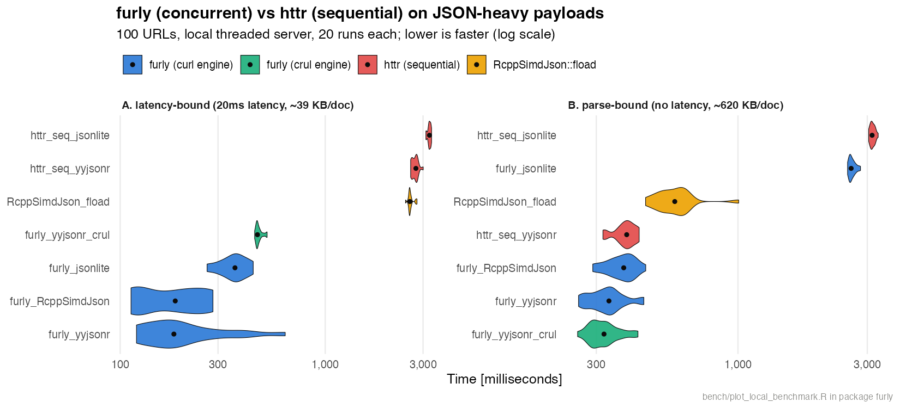

# furly

An R package for **blazing-fast concurrent downloads** and JSON parsing.

<!-- badges: start -->
<!-- badges: end -->

`furly` combines an asynchronous, HTTP/2-multiplexing download engine with a
fast, pluggable JSON parser (`yyjsonr`, `RcppSimdJson`, or `jsonlite`). It is
built for fetching many endpoints at once — paginated APIs, batches of records,
fan-out requests — while staying **correct**:

- **Order-preserving** — results line up 1:1 with the input URLs (a naive async
  loop returns them in completion order, silently scrambling paginated data).
- **No silent drops** — every failed URL yields a `furl_error` in its slot, so
  the output always matches the input length. Inspect failures with
  `furl_errors()`.
- **Automatic retries** — transient failures (network errors, HTTP 429, HTTP
  5xx) are retried with exponential backoff.
- **Configurable** — custom headers/auth, timeouts, user-agent, and
  connection/multiplexing limits.
- **GET and POST** — issue `GET`, or `POST`/`PUT`/`PATCH` with per-request
  bodies (JSON auto-serialized), for fan-out over write endpoints and batch
  APIs.

## Installation

```r
# development version
devtools::install_github("melsiddieg/furly")
```

`curl` is the only hard dependency. Install at least one JSON backend for
`furly()`; `yyjsonr` (the R binding to [yyjson](https://github.com/ibireme/yyjson))
is the recommended default, with `RcppSimdJson` required for JSON-Pointer
queries and `jsonlite` as a universal fallback:

```r
install.packages(c("yyjsonr", "RcppSimdJson"))  # optional, pick what you need
```

## Usage

### JSON convenience layer

```r
library(furly)

urls <- paste0(
  "https://api.example.com/genes?limit=500",
  "&skip=", c(0, 500, 1000, 1500)
)

res <- furly(urls)                      # parsed JSON, in input order
res <- furly(urls, query = "/result")   # extract a JSON Pointer per document (RcppSimdJson)
res <- furly(urls, parser = "yyjsonr")  # force a specific backend
furl_errors(res)                        # which URLs failed, and why
```

`furly()` stays backward compatible with the original `furly(urls, query = NULL)`
signature.

### Raw download engine

Use `furl_download()` when you want the bytes rather than parsed JSON — any
content type, optionally streamed to files:

```r
res <- furl_download(
  urls,
  headers   = c(Authorization = "Bearer <token>"),
  timeout   = 30,
  max_tries = 5,
  host_con  = 8,       # concurrent connections per host
  progress  = TRUE
)

# save bodies to disk instead of returning them
furl_download(urls, destfiles = sprintf("out/%d.json", seq_along(urls)))
```

### POST and request bodies

Both `furly()` and `furl_download()` take `method` and `body`, so you can fan
out `POST`/`PUT`/`PATCH` requests with the same order-preserving, retrying,
drop-nothing contract as GET. R objects (and named lists) are serialized to
JSON automatically (`Content-Type: application/json`); raw vectors and strings
are sent as-is.

```r
# One shared body sent to every URL
furly(urls, method = "POST", body = list(action = "refresh"))

# A different body per URL (unnamed list, length == length(urls))
furly(
  rep("https://api.example.com/v1/score", 3),
  method  = "POST",
  body    = list(list(text = "a"), list(text = "b"), list(text = "c")),
  headers = c(Authorization = "Bearer <token>")
)
```

This is the shape most batch/LLM-style APIs want: many concurrent `POST`s to
one endpoint, each with its own JSON payload, parsed back in input order.
`body` disambiguates by structure — an **unnamed list of length `length(urls)`**
is treated as one body per URL; anything else (a scalar, a raw vector, a named
list, a JSON string) is a single body broadcast to all URLs. A `body` requires
a non-GET `method`.

### Response compression

Requests are sent with `Accept-Encoding: gzip` by default, and libcurl
transparently decompresses the response — usually a large transfer-size win on
JSON APIs (a GitHub commits page shrinks ~6× on the wire, 418 KB → 68 KB).
Override it with `accept_encoding`:

```r
furl_download(urls)                              # gzip (default)
furl_download(urls, accept_encoding = "")        # advertise every codec libcurl has (e.g. br/zstd)
furl_download(urls, destfiles = paths,
              accept_encoding = "identity")      # skip compression for already-compressed payloads
```

## Parser backends

| Backend        | When it's used                        | Notes |
|----------------|---------------------------------------|-------|
| `yyjsonr`      | default (`parser = "auto"`, no query) | Fast; parses raw bytes; NDJSON + JSON writing |
| `RcppSimdJson` | when `query` (JSON Pointer) is given  | Batch path extraction via `fparse(query=)` |
| `jsonlite`     | universal fallback                    | Always available, slower |

## Benchmarks

**End-to-end (download + parse).** `bench/benchmark.R` runs a reproducible
comparison against a local [`webfakes`](https://webfakes.r-lib.org) server,
covering a `jsonlite` sequential loop, `RcppSimdJson::fload`, and `furly()` with
each installed backend:

```r
Rscript bench/benchmark.R 100
```

Note: `webfakes`' in-process test server handles requests **sequentially**, so
the local benchmark measures parsing throughput and correctness — not the
latency-hiding win of concurrency. That win shows up against real remote servers
that accept concurrent connections, where `curl`'s multi interface overlaps the
round-trips instead of paying them one at a time.

**Parser backends only.** `bench/parse_benchmark.R` isolates the JSON parsing
layer — no network — so you can compare raw throughput of the `yyjsonr`,
`RcppSimdJson`, and `jsonlite` backends (plus the `RcppSimdJson` JSON-Pointer
`query=` path) on a synthesized corpus of raw JSON bodies:

```r
Rscript bench/parse_benchmark.R 2000 300   # n_docs, values_per_doc
```

Each backend is checked for correctness before timing. `microbenchmark` is used
when installed; otherwise the script falls back to a built-in `replicate()`
timer so it runs with no extra dependencies. A representative run parsing 2000
documents (~2.7 MB) shows `RcppSimdJson` and `yyjsonr` an order of magnitude
ahead of `jsonlite`:

| Backend               | Median (ms) |
|-----------------------|-------------|
| `RcppSimdJson` (query)| ~3          |
| `RcppSimdJson`        | ~5          |
| `yyjsonr`             | ~7          |
| `jsonlite`            | ~145        |

(Absolute numbers vary by machine; the ratios are the point.)

**vs. `httr` (concurrent vs sequential).** `bench/httr_benchmark.R` compares
`furly()` against a sequential `httr` download loop on JSON-heavy payloads,
across every parser backend. It needs a *concurrent* server, so it drives a
small threaded one (`bench/json_server.py`) instead of the sequential
`webfakes` process:

```r
python3 bench/json_server.py 8099 &        # threaded JSON server
Rscript bench/httr_benchmark.R 100 50      # n_urls, host_con
```

`bench/github_benchmark.R` runs the same comparison against the **live GitHub
REST API** (paginated commit history — a moderately JSON-heavy, real-latency,
real-world workload). Authenticate to lift the rate limit:

```r
GITHUB_TOKEN=$(gh auth token) Rscript bench/github_benchmark.R 40 30 10  # pages, per_page, host_con
```

The headline result across both: when requests carry real network latency,
`furly`'s concurrency runs **~8–9× faster than sequential `httr`** (e.g. 1.5 s
vs 13.6 s for 40 pages of the GitHub commits API), and the *parser* backend
barely matters (~10%) because the workload is network-bound. When there is no
latency to hide (huge local payloads), the picture flips: fetching is instant,
concurrency can't help, and the fast parsers (`yyjsonr`, `RcppSimdJson`) pull
**~8–10× ahead of `jsonlite`**. Rule of thumb: pick `furly` for the fetch when
data is remote; pick a fast parser when the bottleneck is parsing.

`bench/plot_local_benchmark.R` renders these two scenarios as a violin plot
(timing distributions over 20 runs each, log scale):

```r
python3 bench/json_server.py 8099 &
Rscript bench/plot_local_benchmark.R 100 50 20   # -> bench/furly_vs_httr.png
```



Left (**latency-bound**): every `furly` config finishes in ~0.2–0.5 s while
sequential `httr` sits at ~3 s — concurrency dominates. Right (**parse-bound**):
with no latency to hide, the `jsonlite` configs blow out to ~3 s while the fast
parsers cluster near ~0.3 s — the parser dominates.

## Verifying correctness

The test suite (`tests/testthat/`) spins up a local `webfakes` server and checks
order preservation, per-URL error reporting, retry-until-success, header
delivery, and parser parity:

```r
devtools::test()
```
